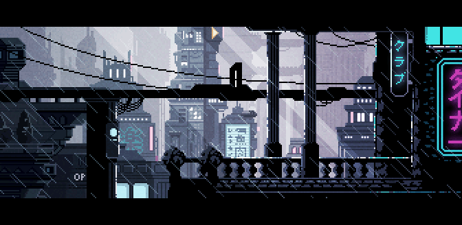

  

 

  

<!-- END HEADER -->

---

## About Me

I'm Ygnacio — passionate about coding engaging apps, and looking to venture into game dev.
From Kitchener, ON, Canada. Currently learning Unreal Engine & Unity.

---

### 🧰 Languages and Tools

 

